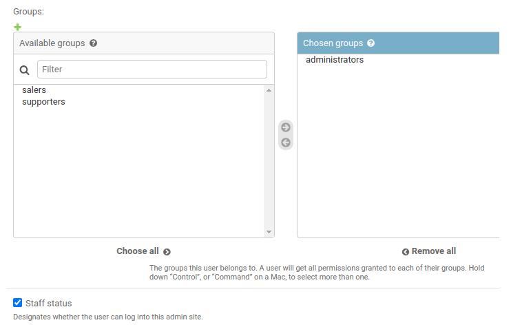
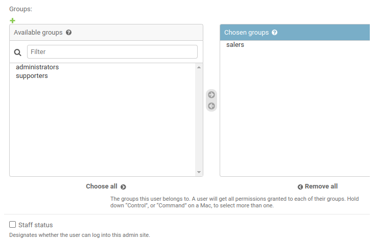
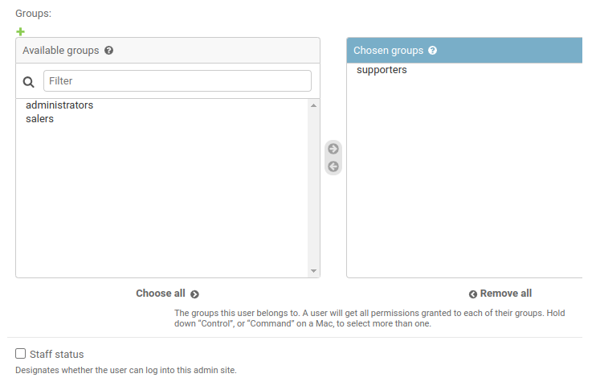

# Créez une API sécurisée RESTFUL en utilisant Django Rest
Projet 12 de la formation Openclassrooms Développeur d'application Python

## Description
Ce projet a pour objectif de créer un système CRM à l'entreprise.

L'application Django fournit un ensemble d’endpoints sécurisés pour l’API à l'aide du framework Django REST (avec une base de données PostgreSQL) pour permettre les opérations CRUD (créer, lire, mettre à jour et supprimer) appliquées aux divers objets CRM. L'interface front-end utilise le site d'administration Django et Django Rest Browsable API, laquelle permettra aux utilisateurs autorisés de gérer l'application, d'accéder à l'ensemble des modèles et de vérifier la configuration de la base de données.

Les membres de l'équipe :

- Les administrateurs utilise le site d'administration Django et peuvent ajouter de nouveaux utilisateurs au système CRM et leur attribuer des autorisations. Ils peuvent afficher et modifier toutes les données dans le système CRM.

- Les membres de l'équipe de vente peuvent ajouter de nouveaux clients dans le système CRM à mesure qu'ils obtiennent des prospects. Ils peuvent garantir l'exactitude des informations relatives aux clients et les modifier au besoin (notamment pour les convertir en client existant). Ils peuvent créer de nouveaux contrats pour un nouvel événement potentiel. Ce contrat ouvert peut être considéré comme signé. Les utilisateurs peuvent créer un nouvel événement pour un contrat.

- Les membres de l'équipe de support peuvent afficher et actualiser les informations relatives aux événements qui leur sont attribués. Ils peuvent afficher les informations du client relatives aux événements attribués. Ils peuvent actualiser les informations d'un événement jusqu'à ce qu'il soit terminé.

## Procédure d'installation

### Import du dépôt Github
Dans un dossier de travail, importez le dépôt github puis, changez de répertoire courant pour vous positionner dans le répertoire cloné. 
```sh
$ git clone https://github.com/lcourdes/Django-ORM-backend-securise.git
$ cd CRM_epic_event
```

### Création d'un environnement virtuel
Il est recommandé d'installer un environnement virtuel. Pour ce faire, suivez les instructions 
ci-dessous :

- S'il ne l'est pas déjà, installez le package *virtualenv* :
```sh
$ pip install virtualenv
```

- Créez un environnement de travail et activez-le :
```sh
$ python3 -m venv env
$ source env/bin/activate
```

### Installation des librairies
Installez les librairies nécessaires au bon fonctionnement du programme à l'aide du fichier requirements.txt :
```sh
$ pip install -r requirements.txt
```

### Lancement du serveur

Pour démarrer le programme, déplacez-vous dans le projet Django.
```sh
$ cd application
```

Django est actuellement configuré pour utiliser une base de données Postgresql intitulée crm_epic_event. Lorsque cette base existe effectuez les migrations :
```sh
$ python3 manage.py migrate
```

Vous pouvez ensuite démarrer le server :
```sh
$ python3 manage.py runserver
```

L'adresse est fournie dans le terminal et peut être ouverte dans un navigateur.

## Utilisation du site d'administration Django
### Authentification

Lorsque le serveur est lancé, vous pouvez accéder à l'interface d'aministration via l'URI /admin/.
Vous pouvez vous connecter pour créer de nouveaux utilisateurs grâce aux données suivantes :

> Nom d'utilisateur : admin
>
> Mot de passe : 1234

### Création de nouveaux utilisateurs

Pour créer de nouveaux utilisateurs, allez sur le lien *Users* puis cliquez sur *add*.
Après avoir renseigné un nom d'utilisateur et un mot de passe, il faut renseigner d'autres éléments tels qu'un nom de famille, un prénom, une adresse email, etc.
Attention, il faut impérativement attribuer un groupe pour chaque nouvel utilisateur afin de lui attribuer les permissions nécessaires. 
Les membres de l'équipe d'administration, de vente et de support doivent être respectivement attribués au groupe administrators, salers et supporters.
Enfin, afin de garantir l'accès au site d'administration de Django par les membres de l'équipe de gestion (administrateur), il faut cocher la case *is_staff*.

Membre de l'équipe d'administration :



Membre de l'équipe de vente :


Membre de l'équipe de support : 


## Utilisation du browsable API de Django REST

### Authentification
Tout utilisateur disposant d'un nom d'utilisateur et d'un mot de passe peuvent se connecter à l'URI suivante : /

### En cours d'utilisation 
Les utilisateurs peuvent avoir accès aux adresses suivantes : 
- /clients/
- /clients/{id}/
- /contrats/
- /contrats/{id}/
- /events/
- /events/{id}/

Pour plus d'informations, consultez la rubrique **Les points de terminaison** ci-dessous.

### Déconnexion
Pour se déconnecter, accéder à l'URI suivante : /logout/

## Les points de terminaison

Tous les points de terminaison ont été documentés sur PostMan. Pour plus d'informations, vous pouvez consulter cette documentation via le lien suivant :

[](https://documenter.getpostman.com/view/25647707/2s93RKzazc)

### Authentification et déconnexion

| Points de terminaison d'API  | Méthode HTTP | URI      |
|------------------------------|--------------|----------|
| Connexion de l'utilisateur   | POST         | /        |
| Déconnexion de l'utilisateur | GET          | /logout/ |

### Gestion des clients

| Points de terminaison d'API            | Méthode HTTP | URI            |
|----------------------------------------|--------------|----------------|
| Créer des clients                      | POST         | /clients/      |
| Récupérer la liste de tous les clients | GET          | /clients/      |
| Visualiser les détails d'un client     | GET          | /clients/{id}/ |
| Modifier un client                     | PUT          | /clients/{id}/ |

### Gestion des contrats

| Points de terminaison d'API            | Méthode HTTP | URI            |
|----------------------------------------|--------------|----------------|
| Créer des contrats                     | POST         | /contrats/     |
| Récupérer la liste de tous les contrats| GET          | /contrats/     |
| Visualiser les détails d'un contrat    | GET          | /contrats/{id}/|
| Modifier un contrat                    | PUT          | /contrats/{id}/|

### Gestion des événements

| Points de terminaison d'API          | Méthode HTTP | URI          |
|--------------------------------------|--------------|--------------|
| Créer des events                     | POST         | /events/     |
| Récupérer la liste de tous les events| GET          | /events/     |
| Visualiser les détails d'un event    | GET          | /events/{id}/|
| Modifier un event                    | PUT          | /events/{id}/|

## Lien Github

[](https://github.com/lcourdes/Django-ORM-backend-securise)
